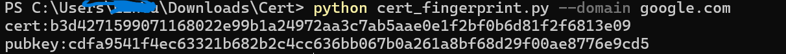

# Certificate Detector

<p align="center">
  
</p>

<p align="center">
  <a href="https://github.com/AndrewWangDev/Certificate-detector/blob/main/LICENSE">
    
  </a>
  
  
</p>

> Automatically extracts the SHA-256 fingerprints of TLS certificates and public keys from domain names and .pem files, which can be used to fix certificates on proxy clients.

## 📖 Overview

Implementing **Client-Side Certificate or Public Key Pinning** requires embedding precise cryptographic hashes into your application. Traditionally, extracting these hashes demands complex, multi-step `openssl` command chains. 

**Certificate Detector** automates this workflow. Whether you need to inspect a live production server or parse a local PEM file, this tool provides standardized, pinning-ready fingerprints in a single command.

---

## ✨ Key Features

* **Live Server Inspection:** Directly connect to remote endpoints and extract peer certificates via TLS handshakes.
* **Local File Parsing:** Robust parsing of local `.pem` or `.crt` certificate files.
* **SPKI Extraction:** Automatically computes the Subject Public Key Info fingerprint, highly recommended for resilient pinning strategies.
* **Highly Configurable:** Granular control over target ports, connection timeouts, and output verbosity.
* **Cross-Platform & Zero OS Dependencies:** Runs flawlessly on any OS with Python, bypassing the need for native OpenSSL binaries.

---

## 📸 Demo

Testing the fingerprint extraction against a live domain:



---

## ⚙️ Installation

**Prerequisites:** Python 3.6+

1.  **Clone the repository:**
    ```bash
    git clone [https://github.com/AndrewWangDev/Certificate-detector.git](https://github.com/AndrewWangDev/Certificate-detector.git)
    cd Certificate-detector
    ```

2.  *(Optional but recommended)* **Create a virtual environment:**
    ```bash
    python -m venv venv
    source venv/bin/activate  # On Windows: venv\Scripts\activate
    ```

3.  **Install the required cryptography package:**
    ```bash
    pip install cryptography
    ```

---

## 🚀 Usage Guide

### Display Help Menu
```bash
python cert_detector.py --help
```

### 1. Remote Domain Extraction (Standard Port 443)
Fetch both the full Certificate Hash and the Public Key Hash from a remote host.
```bash
python cert_detector.py --domain example.com
```
*Output:*
```text
cert:WoiBE123456...
pubkey:A1b2C3d4E5...
```

### 2. Remote Domain with Custom Port & Timeout
Specify a non-standard port and adjust the network timeout (in seconds).
```bash
python cert_detector.py -d myapi.example.com:8443 --timeout 10.0
```

### 3. Local PEM File Parsing
Extract fingerprints from a previously downloaded certificate file.
```bash
python cert_detector.py --file ./certs/production_cert.pem
```

### 4. Isolate Public Key Fingerprint
For modern applications, pinning the **Public Key (SPKI)** is strongly recommended over the full certificate. This allows seamless certificate renewals as long as the underlying private/public key pair remains unchanged.
```bash
python cert_detector.py -d example.com --output pubkey
```
*Output:*
```text
A1b2C3d4E5...
```

---

## 🧰 Command-Line Arguments

| Flag | Short | Description | Required |
| :--- | :--- | :--- | :--- |
| `--domain` | `-d` | Target domain or IP address, optionally with a port (e.g., `api.com:443`). | Mutually exclusive with `--file`. |
| `--file` | `-f` | Path to a local PEM/CRT formatted certificate file. | Mutually exclusive with `--domain`. |
| `--timeout` | `-t` | TLS handshake timeout in seconds (Default: `5.0`). | No |
| `--output` | `-o` | Define output mode: `cert` (Certificate only), `pubkey` (Public Key only), or `both` (Default). | No |

---

## 🛡️ Security Best Practices

When implementing pinning in production applications (e.g., iOS, Android, or IoT clients):

1.  **Prefer Public Key Pinning:** Pinning the `pubkey` prevents unexpected application outages when a CA rotates the server's certificate, provided the same Private Key is used to generate the new CSR.
2.  **Backup Pins:** Always include a backup pin (a fingerprint of a secondary key held securely offline) to ensure availability if your primary key is compromised.

---

## 📄 License

This project is open-sourced under the [MIT License](LICENSE).